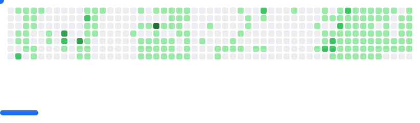

    

---

<picture>
  <source
    media="(prefers-color-scheme: dark)"
    srcset="images/breakout-dark.svg"
  />
  <source
    media="(prefers-color-scheme: light)"
    srcset="images/breakout-light.svg"
  />
  
</picture>

## 👋 About Me
- **Name:** Mohamed Amine JABOU
- **Role:** Software Developer and Tech Enthusiast
- **Goals:** Building innovative and scalable solutions 🚀 and mastering software architecture.
- **Passion:** Problem-solving, and crafting impactful solutions.
- **Soft Skills:** Adaptability, teamwork, and problem-solving mindset.
- **Interests:** Fitness, Web and Mobile Development.

---

## 🌐 Connect with Me
- 📫 Email: [jabou.medamine@gmail.com](mailto:jabou.medamine@gmail.com)
- 🌐 My Resume
    - [CV](https://github.com/MeDjb10/MeDjb10/blob/main/JabouMohamedAmineCV.pdf)
    - [ATS-Compatible CV](https://github.com/MeDjb10/MeDjb10/blob/main/JabouMohamedAmine-PFE-CV.pdf)
- 📱 Social:
  - [LinkedIn](https://www.linkedin.com/in/mohamed-amine-jabou-7b1980337/)
  - [Instagram](https://www.instagram.com/medaminejb_03/)

---

## 🔧 Skills

### Programming Languages

### Frameworks & Libraries

### Tools & Technologies

### Methodologies
- Agile (Scrum)
- Clean Architecture
- Microservices
- Service-Oriented Architecture (SOA)

## 📈 GitHub Stats

    
    
    
    

---
